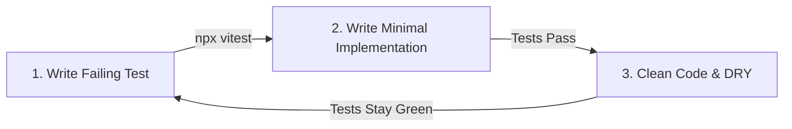

# Test-Driven Development (TDD) Workflow

This skill ensures all feature development, bug fixes, and API integrations follow strict TDD principles to deliver robust, correct software.

## Core Principles

1. **Write Tests BEFORE Implementation**:
   Always write test specs (that initially fail) before implementing the actual feature logic.
2. **Mandatory test coverage**:
   Every new component, helper utility, or database service should have at least one happy-path and two edge-case test blocks.
3. **Vitest (Node.js/React)**:
   Use Vitest for backend Node.js services and React frontend components.

---

## The TDD Red-Green-Refactor Loop



---

## Implementation Patterns

### 1. Node.js Service Integration Test (Vitest)
```js
// src/__tests__/yield.test.js
import { describe, it, expect, beforeEach, vi } from 'vitest';
import { calculateExpectedYield } from '../services/zbnf-yield.js';

describe('ZBNF Yield Calculator', () => {
  it('should calculate correct yield for banana plots', () => {
    const plot = { crop: 'banana', area_decimals: 1.5 };
    const result = calculateExpectedYield(plot);
    
    // Exact ratio validation
    expect(result.expected_kg).toBe(4500); 
    expect(result.status).toBe('success');
  });

  it('should fail gracefully for unsupported crops', () => {
    const plot = { crop: 'unknown_crop', area_decimals: 1.5 };
    expect(() => calculateExpectedYield(plot)).toThrow('Unsupported crop');
  });
});
```

### 2. React UI Component Test (Vitest + Testing Library)
```jsx
// client/src/modules/__tests__/KrishiForm.test.jsx
import { render, screen, fireEvent } from '@testing-library/react';
import { describe, it, expect, vi } from 'vitest';
import KrishiForm from '../KrishiForm.jsx';

describe('KrishiForm Component', () => {
  it('requires plot area value before submitting', () => {
    render(<KrishiForm onSubmit={vi.fn()} />);
    
    const submitButton = screen.getByRole('button', { name: /সংরক্ষণ করুন/i });
    fireEvent.click(submitButton);

    expect(screen.getByText(/জমির পরিমাণ প্রয়োজন/i)).toBeInTheDocument();
  });
});
```

---

## Common Mistakes to Avoid

*   ❌ **No Test Isolation**: Never let tests write persistent records without cleanups. Mock database queries or truncate SQLite/Dexie transactions in `afterEach`.
*   ❌ **Testing Implementation Details**: Do not assert private methods or internal state variables. Test user-visible outcomes and function data contracts.
*   ❌ **Skipping Error Paths**: Ensure you test at least one invalid/boundary input (negative numbers, empty strings, null values).
